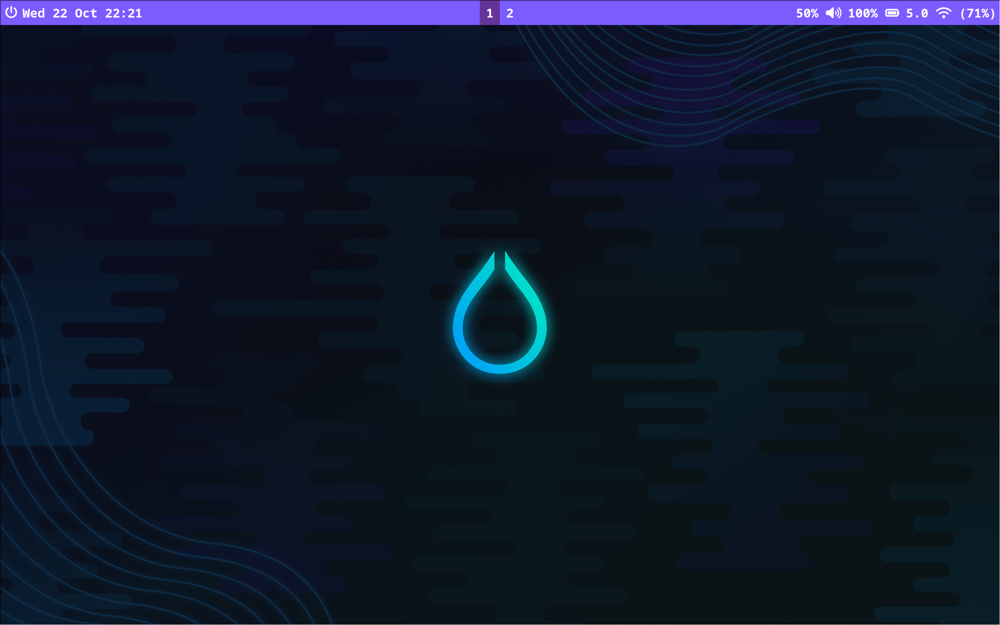
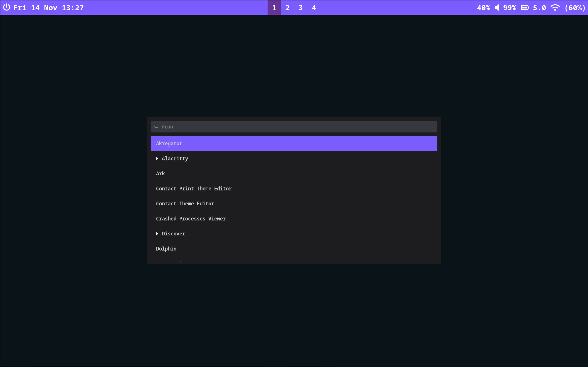
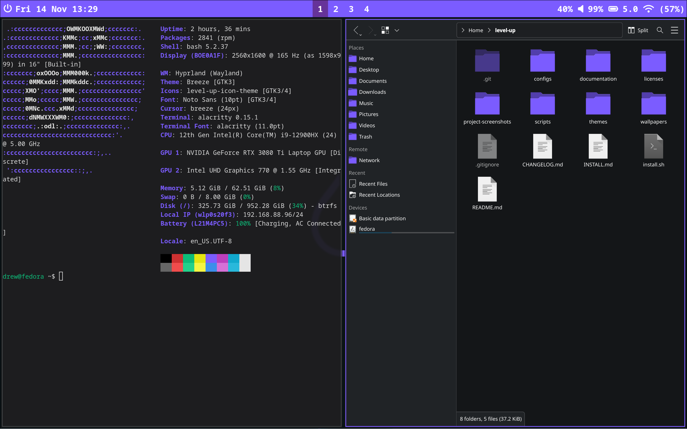

# Level-Up

**Level-Up** is a customizable desktop environment built on **Fedora 42 KDE Plasma Desktop Edition**, featuring **Hyprland** as the dynamic window manager. It comes preconfigured with a curated set of tools and aesthetic customizations, including **Waybar**, **Alacritty**, **Fastfetch**, **Dolphin**, and more.

> Linux is about making your computer work for you.  
> This configuration is meant to be a starting point, not a final product. Feel free to try it out, tweak it, and make Level-Up your own.

---

## Project Status: Work in Progress

This project is under development and evolving as I learn and grow. Features may change over time, and feedback is welcome.

I started learning Linux in June 2025, and this project serves as a hands-on way to deepen my Linux knowledge. Prior to working on this project I had no experience in GitHub, scripting, or programming.

For a detailed summary of the skills, challenges, and lessons I learned while building this project, see the [Lessons Learned](docs/lessons-learned.md) document.

---

## Project Screenshots

Below are some screenshots showcasing **Level-Up** in action:

  
_An example of the main user interface._

  
_The Fastfetch and Alacritty customizations in action._

  
_A view of the Wofi application launcher on this system._

  
_A layout with a few applications open in a tiled setup. Dolphin is using the Level-Up-Icon theme, configured through the KDE Icon Settings._

---
## Installation

Before proceeding with the installation, please **read the [Compatibility and Security Disclaimer](docs/compatibility-and-security-disclaimer.md)** to ensure that your system meets the necessary requirements and to be aware of any potential issues.

Once you've reviewed the disclaimer, follow the steps in the [INSTALL.md](INSTALL.md) to get started with the installation.

---

## Documentation

Optional guides and resources are available in the [docs](docs/) folder, including:
- [Compatibility-and-Security-Disclaimer](docs/compatibility-and-security-disclaimer.md) – Disclaimer regarding compatibility and security considerations.
- [INSTALL](INSTALL.md) – Installation instructions for setting up the project.
- [CHANGELOG](CHANGELOG.md) – Project version history and updates.
- [Branches Overview](docs/branches.md) – Overview of branches, including their purposes, changes, and related issues.
- [Logging-Locations-and-Troubleshooting](docs/logging-locations-and-troubleshooting.md) – Guide on where to find logs for the installation process, hyprland, waybar, and troubleshooting tips.
- [Post-Install Resources](docs/post-install-resources.md) – Optional tools, drivers, and tweaks.
- [Fedora KDE Plasma SSH Setup](docs/fedora-kde-plasma-ssh-setup.md) – Optional SSH configuration tips.
- [Github Private Repo Access Setup](docs/github-private-repo-access-setup.md) – Optional setup guide for private repo access.
- [Linux Boot Time Optimizations](docs/linux-boot-time-optimizations.md) – Tips for faster boot times.
- [VPN Private Internet Access Setup](docs/vpn-private-internet-access-setup.md) – Optional VPN configuration guide.
- [Acknowledgments](docs/acknowledgments.md) – Credits for referenced open-source projects.

---

## Feedback & Suggestions

---

This project is part of my ongoing journey to learn Linux. I welcome constructive feedback, ideas, and suggestions that can help me improve and refine **Level-Up**.

At this time, I’m not accepting direct code contributions or pull requests. I want this project to reflect my personal growth over time, so code changes from others will be rejected. However, I truly appreciate hearing different perspectives and learning from community input.

If you’d like to share feedback or suggestions, please use the **Discussions tab**:

- Leave a comment or suggestion in the [Discussions tab](https://github.com/Always-Growing/level-up/discussions/31) to share your thoughts, ideas, or recommendations.

If you're reporting a problem or bug, please open an **Issue**:

- Open an [issue](../../issues) for any bugs, errors, or technical problems that need attention.

Thank you for being part of this journey

---

## Licensing

---

**Level-Up** is licensed under the **Level-Up License**, which grants you the freedom to use, modify, and distribute the project. However, certain conditions must be met for redistribution and modification. Please refer to the full **Level-Up License** in the [Level-Up License](licenses/level-up-license.txt) file for the complete terms.

This project also incorporates third-party software with their respective licenses. Please refer to the [licenses/](licenses/) directory for the licenses of third-party software used in this project.

For more details on the Level-Up License, please see the full [Level-Up License](licenses/level-up-license.txt) file.

---

If you believe any licensing is missed or not properly acknowledged in this project, please reach out to me directly so I can update the licensing to remedy any issues. Your help in ensuring proper licensing is greatly appreciated.

---

### Icon Theme

The **Level-Up Icon Theme** (purple variant of Breeze Dark) included in this project is a derivative work of the **Breeze Dark Icon Theme** by the KDE Community.

- Original Breeze Dark Icon Theme: © KDE Community, licensed under the **GPL v2 or later**.
- Level-Up modifications: © Always-Growing / 2025, licensed under the **GPL v3**.

The full license for the Level-Up Icon Theme can be found in the [Level-Up-Icon-Theme-LICENSE](licenses/level-up-icon-theme.txt) file.

